<!-- portfolio:start -->
<p align="center">
  
</p>

<h1 align="center">MotionForge</h1>

<p align="center"><strong>A kinetic playground for scroll-driven motion, live snippets, and expressive web sections.</strong></p>

<p align="center">

  
  
</p>

## Kinetic Identity

MotionForge is the loudest visual repo in the set: bold cards, moving text, scroll choreography, and copy-ready motion patterns.

## What It Offers

A motion showcase plus an editor-like surface for playing with animation ideas.

## Run The Lab

`npm install` then `npm run dev` or open the static page depending on your setup.

## Portfolio Note

This repository has its own visual identity inside the portfolio. The goal is that every project feels like a different product, not another copy of the same template.
<!-- portfolio:end -->

---

## Existing Project Notes

# MotionForge

MotionForge is a visual GSAP + ScrollTrigger playground for building scroll-driven web sections.

It shows the animation patterns directly in the page: kinetic text, sticky scenes, scrubbed scroll movement, floating labels, horizontal cards, live presets, and copy-ready HTML/CSS/JS.


## What It Does

- Demonstrates real scroll-controlled animation with GSAP ScrollTrigger.
- Uses scrub, pin, labels, sticky scenes, floating tags, animated showcase cards, marquees, and horizontal movement.
- Includes a friendly motion editor with presets, sliders, visible readouts, a playbar, and a changing preview scene.
- Generates copy-ready HTML, CSS, and JavaScript.
- Ships local GSAP, ScrollTrigger, and simpleParallax files so the demo does not depend on CDN loading.
- Respects `prefers-reduced-motion`.

## Run

```bash
npm run check
npm run start
```

Open:

```text
http://localhost:5240
```

You can also open `index.html` directly in a browser.

## Stack

- HTML
- CSS
- JavaScript
- GSAP
- ScrollTrigger
- simpleParallax

## Why It Exists

Scroll animation is easier to understand when you can feel it in the page. MotionForge is a small visual lab for learning how GSAP motion works and exporting a clean starting point for real projects.
