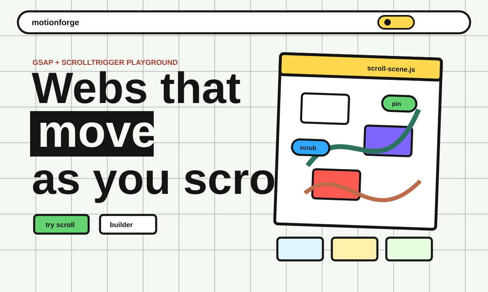

# MotionForge

MotionForge is a visual GSAP + ScrollTrigger playground for building scroll-driven web sections.

It shows the animation patterns directly in the page: sticky scenes, scrubbed scroll movement, floating labels, horizontal cards, live presets, and copy-ready HTML/CSS/JS.



## What It Does

- Demonstrates real scroll-controlled animation with GSAP ScrollTrigger.
- Uses scrub, pin, labels, sticky scenes, floating tags, and horizontal movement.
- Includes a friendly motion editor with presets and sliders.
- Generates copy-ready HTML, CSS, and JavaScript.
- Uses simpleParallax for a depth layer.
- Respects `prefers-reduced-motion`.

## Run

```bash
npm run check
npm run start
```

Open:

```text
http://localhost:5240
```

You can also open `index.html` directly in a browser.

## Stack

- HTML
- CSS
- JavaScript
- GSAP
- ScrollTrigger
- simpleParallax

## Why It Exists

Scroll animation is easier to understand when you can feel it in the page. MotionForge is a small visual lab for learning how GSAP motion works and exporting a clean starting point for real projects.
